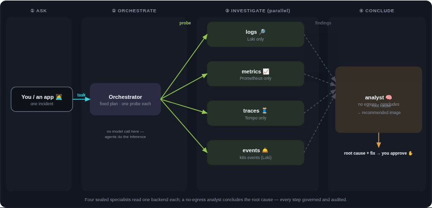
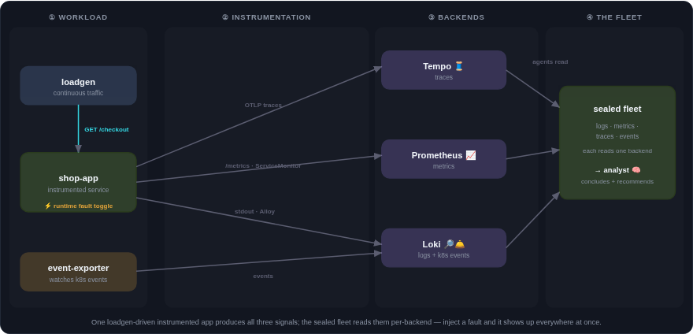
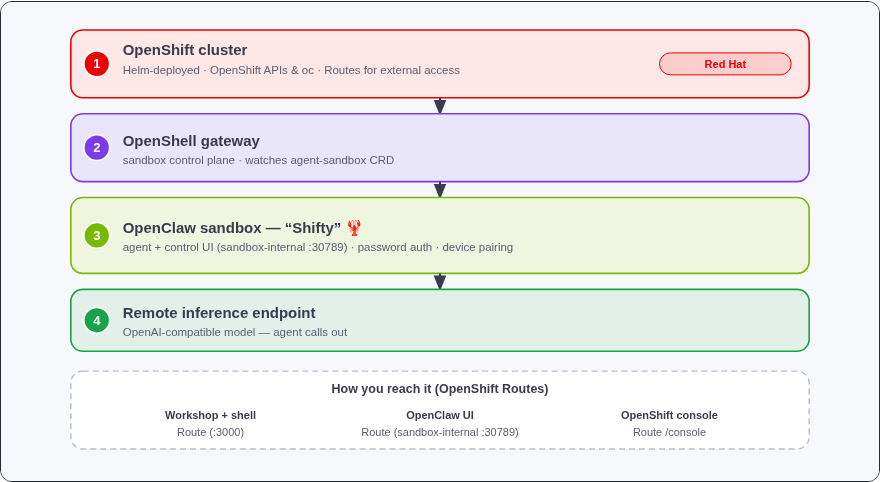
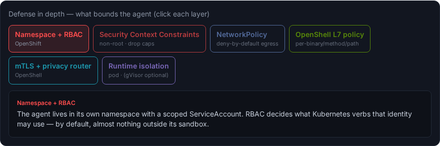
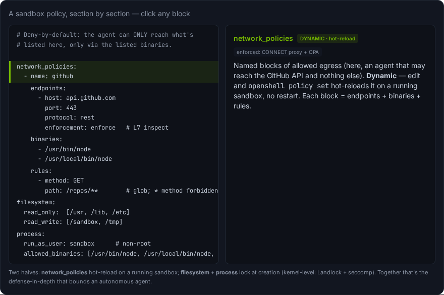

# AIOps on OpenShift — A Sandboxed Agent Fleet for Incident Response

*A Sample Implementation Using OpenShell and OpenClaw*

[](https://github.com/ansjindal/nemoclaw-openshift-launchable/actions/workflows/ci.yml)
[](https://github.com/ansjindal/nemoclaw-openshift-launchable/releases/latest)
[](LICENSE)


A fleet of sandboxed AI agents investigates a real application outage on Red Hat OpenShift — each agent scoped to exactly one observability backend, governed by deny-by-default policies, and coordinated by an analyst that synthesizes their findings into a root-cause diagnosis and recommended fix. No GPU needed — inference is remote.

Built by Anshul Jindal and Max Murakami.

## Table of Contents

- [Detailed description](#detailed-description)
  - [The SRE use case](#the-sre-use-case)
  - [Architecture diagram](#architecture-diagram)
  - [Workshop curriculum](#workshop-curriculum)
- [Requirements](#requirements)
  - [Minimum hardware requirements](#minimum-hardware-requirements)
  - [Minimum software requirements](#minimum-software-requirements)
- [Deploy](#deploy)
  - [Prerequisites](#prerequisites)
  - [Deployment](#deployment)
  - [Configuration options](#configuration-options)
  - [Validating the deployment](#validating-the-deployment)
  - [Provisioning the OpenClaw agent](#provisioning-the-openclaw-agent)
  - [Delete](#delete)
- [Technical details](#technical-details)
  - [Architecture](#architecture)
  - [Helm chart structure](#helm-chart-structure)
  - [Key design decisions](#key-design-decisions)
  - [Components](#components)
- [Reference](#reference)
- [Tags](#tags)

## Detailed description

### The SRE Use Case

An instrumented shop application runs on OpenShift with a continuous load generator. A real dependency — the `payments` microservice — is killed (`kubectl scale deploy/payments --replicas=0`), and checkout requests start failing with connection-refused errors. The error rate climbs to 100%.

Five sealed AI agents, each running in its own sandbox pod with a deny-by-default egress policy, investigate the incident in parallel:



| Agent | Backend | What it finds |
|-------|---------|---------------|
| **Scout** (logs) | Loki Operator gateway | `"checkout failed: payment call failed"` |
| **Gauge** (metrics) | Thanos Querier | 5xx spike, request success rate drops to 0% |
| **Trace** (traces) | Tempo gateway | Failing `charge-payment` span in error traces |
| **Probe** (events) | Loki Operator gateway (event-exporter) | `payments scaled to 0` Kubernetes event |
| **Sage** (analyst) | None — zero egress | Synthesizes all findings into root cause + fix |

Each specialist can only reach its assigned telemetry backend — it cannot touch the cluster API, other backends, or the internet. The analyst has no tools and no egress at all; it only reasons over the other agents' findings. A fixed orchestrator (no LLM "planning" step) dispatches one prescribed probe per specialist, collects results, and hands them to the analyst.

**Outcome:** The analyst concludes the root cause is a dependency outage (`payments` scaled to zero) and recommends `kubectl scale deploy/payments --replicas=1`. The human reviews, approves, and applies the fix. The error rate drops to zero. The agents never modify the cluster — they only read telemetry.

The instrumented workload produces all three signal types (metrics, logs, traces); each specialist agent reads exactly one backend:



This project deploys the full stack needed to run this scenario on any existing OpenShift cluster:

- **OpenShell gateway** — the agent control plane, managing sandboxed agent pods via the `agent-sandbox` CRD
- **OpenClaw agents** — sandboxed AI agents governed by deny-by-default network and API policies
- **Observability stack** — OpenShift operator-based monitoring (Prometheus/Thanos Querier, Loki Operator, Tempo Operator, OTEL Collector) with standalone Grafana for dashboards
- **Interactive workshop website** — a Next.js app with 30+ guided lessons and a live in-browser terminal that walks you through building the entire system from scratch

All inference is remote (OpenAI-compatible endpoint) — no GPU is required on the cluster.

### Architecture Diagram



```
OpenShift cluster
  ├─ agent-sandbox CRD + controller (pinned v0.4.6)
  ├─ openshell namespace
  │    ├─ OpenShell gateway (StatefulSet, gRPC, edge TLS Route with HTTP/2)
  │    ├─ Workshop web app (Deployment + openclaw-forward sidecar)
  │    │    ├─ Next.js on port 3000 (Route: workshop-openshell.<domain>)
  │    │    └─ OpenClaw Control UI on port 8789 (Route: openclaw-ui-openshell.<domain>)
  │    ├─ Verdaccio skill registry
  │    └─ OpenClaw agent sandbox pod (created after provisioning)
  ├─ openshift-monitoring namespace (Cluster Monitoring Operator)
  │    ├─ Prometheus (cluster + user workload monitoring)
  │    ├─ Thanos Querier (federated PromQL API on port 9091)
  │    └─ Alertmanager
  ├─ openshift-logging namespace (Loki Operator + Cluster Logging)
  │    ├─ LokiStack (multi-tenant log aggregation)
  │    └─ ClusterLogForwarder (log collection)
  ├─ observability-hub namespace
  │    ├─ TempoStack (distributed tracing)
  │    ├─ OTEL Collector (trace ingestion)
  │    └─ MinIO (S3 backend for Loki + Tempo)
  ├─ monitoring namespace
  │    ├─ Grafana (Route: grafana-monitoring.<domain>/grafana)
  │    └─ Event exporter → Loki
  └─ demo namespace
       └─ Instrumented shop app (Kustomize, deployed on demand)
```

### Workshop Curriculum

The workshop is organized into seven parts with 30+ lessons:

| Part | Topic | Lessons |
|------|-------|---------|
| **I. Welcome** | The event, the platform, what you need | 2 |
| **II. What's Already Running** | Inspect the deployed stack with `oc` | 4 |
| **III. How OpenShell Works** | Control plane, policies, sandbox lifecycle | 2 |
| **IV. Build Your Agent** | Create, configure, and talk to an OpenClaw agent | 6 |
| **V. Make It Yours & Operate** | Identity, tools, skills, heartbeat, OpenAI API | 6 |
| **VI. Build Something Useful** | Capstone: multi-agent SRE copilot fleet | 6 |
| **VII. Reference** | Live views, observability, troubleshooting | 4 |

Most lessons include a live in-browser terminal connected to the cluster for hands-on exercises.

## Requirements

### Minimum hardware requirements

**Cluster nodes:**
- 2 worker nodes (or 3+ control-plane nodes with scheduling enabled)
- 4 vCPU / 16 GiB memory per worker (for the observability stack + OpenShell + workshop)

**No GPU required.** Inference is served by a remote endpoint.

### Minimum software requirements

| Requirement | Version | Notes |
|-------------|---------|-------|
| Red Hat OpenShift | 4.x | With `cluster-admin` access |
| `oc` CLI | Matching cluster version | Logged in (`oc login`) |
| `helm` CLI | 3.x | For chart installation |
| `yq`, `jq`, `envsubst` | Any | Used by operator management scripts |
| Remote inference endpoint | Any | OpenAI-compatible (`/v1/chat/completions`) |

### Why cluster-admin access is required

The deployment creates several cluster-scoped resources that only a `cluster-admin` can manage. Here is the full list:

| Category | Resource | Why it's needed |
|----------|----------|-----------------|
| **CRDs** | `sandboxes.agents.x-k8s.io` (agent-sandbox v0.4.6) | The OpenShell gateway's Kubernetes compute driver watches this CRD to manage sandbox pod lifecycle. Without it the gateway enters a 404 watch loop and cannot create sandboxes. |
| **Operators** | 5 OLM Subscriptions (Cluster Observability, OpenTelemetry, Tempo, Logging, Loki) | Installed via Operator Lifecycle Manager to provide the observability stack. Each operator creates its own CRDs and controllers. |
| **Namespaces** | `openshell`, `monitoring`, `demo`, `observability-hub` | Created out-of-band (not Helm-managed) so that `helm uninstall` does not delete them and the non-Helm resources inside them. |
| **Cluster config** | `cluster-monitoring-config` ConfigMap in `openshift-monitoring` | Enables User Workload Monitoring so Prometheus scrapes ServiceMonitors in user namespaces. |
| **ClusterRoles** | `<namespace>-workshop` | Grants the workshop pod read access to pods, services, nodes, sandboxes, and routes across namespaces so it can render live cluster views and execute commands in sandbox pods. |
| **ClusterRoleBindings** | `*-monitoring-view`, `*-grafana-monitoring-view`, `*-monitoring-reader-view` | Bind `cluster-monitoring-view` and `view` to the monitoring-reader and Grafana ServiceAccounts so they can query Thanos Querier, Loki gateway, and Tempo gateway. |
| **ClusterRoles** | `openshell-node-reader` (upstream chart) | Lets the OpenShell gateway create `TokenReview` requests and read node information for sandbox scheduling. |
| **SCC grants** | `privileged` SCC → `openshell-sandbox` SA | Sandbox pods need `CAP_SYS_ADMIN` and an Unconfined AppArmor profile because the supervisor performs network namespace mounts during sandbox setup. |
| **SCC grants** | `nonroot` SCC → `grafana` SA | Grafana needs to run as a specific non-root UID that may differ from OpenShift's default namespace-range assignment. |

**Cluster config read:** The deploy script also reads the cluster-scoped `ingresses.config/cluster` resource to auto-detect the `*.apps` domain for Route hostnames. You can skip this by setting `CLUSTER_APPS_DOMAIN` in `.env`.

## Deploy

### Prerequisites

Before deploying, ensure you have:

1. Access to a Red Hat OpenShift 4.x cluster with `cluster-admin` privileges
2. `oc` CLI installed and logged in to the cluster
3. `helm` CLI (v3+) installed
4. `yq`, `jq`, and `envsubst` installed (used by operator management scripts)
5. An OpenAI-compatible inference endpoint (e.g., [NVIDIA NIM](https://build.nvidia.com/), OpenAI, Azure OpenAI, or any `/v1/chat/completions` provider)

### Deployment

1. **Clone the repository and navigate to its root folder**

2. **Configure your environment:**

```bash
cp .env.example .env
```

Edit `.env` and fill in your inference endpoint:

```bash
NEMOCLAW_INFERENCE_BASE_URL="https://integrate.api.nvidia.com/v1"   # your endpoint
NEMOCLAW_MODEL="meta/llama-3.3-70b-instruct"                       # your model
NEMOCLAW_API_KEY="nvapi-..."                                        # your API key
```

3. **Run the deploy script:**

```bash
./scripts/deploy.sh
```

The script will:
- Verify you are logged in to OpenShift and have the required CLI tools
- Deploy the OpenShift observability stack (5 operators + MinIO + TempoStack + LokiStack + OTEL Collector)
- Create namespaces (`openshell`, `monitoring`, `demo`) out-of-band
- Apply the agent-sandbox CRD (pinned to v0.4.6)
- Add the Grafana Helm repository
- Build chart dependencies (recursive — subcharts first, then umbrella)
- Install the **openshell + workshop** release in the `openshell` namespace
- Install the **monitoring** release (Grafana + event-exporter) in the `monitoring` namespace
- Optionally deploy the demo app via Kustomize and bring up the agent fleet

4. **Access the workshop:**

After deployment completes, three Routes are available:

```bash
# Workshop UI
echo "https://workshop-openshell.$(oc get ingresses.config/cluster -o jsonpath='{.spec.domain}')/"

# Grafana dashboards
echo "https://grafana-monitoring.$(oc get ingresses.config/cluster -o jsonpath='{.spec.domain}')/grafana"

# OpenShift Console
echo "https://console-openshift-console.$(oc get ingresses.config/cluster -o jsonpath='{.spec.domain}')/"
```

Open the Workshop URL in your browser and follow the guided lessons.

### Configuration Options

All configuration is done through `.env` (sourced by `deploy.sh`) or Helm `--set` overrides.

| Variable | Required | Default | Description |
|----------|----------|---------|-------------|
| `NEMOCLAW_INFERENCE_BASE_URL` | Yes | — | Remote inference endpoint URL |
| `NEMOCLAW_MODEL` | Yes | — | Model ID served by the endpoint |
| `NEMOCLAW_API_KEY` | Yes | — | API key for the inference endpoint |
| `CLUSTER_APPS_DOMAIN` | No | Auto-detected | The cluster's `*.apps` domain for Route hostnames |
| `OPENCLAW_GATEWAY_PASSWORD` | No | `openclaw` | Password for the OpenClaw Control UI |
| `MONITORING_GRAFANA_PASSWORD` | No | `openclaw` | Grafana admin password |
| `DEPLOY_DEMO_APP` | No | `true` | Deploy the instrumented demo app to `demo` namespace |
| `PROVISION_AGENT` | No | `false` | Auto-create the OpenClaw agent during deploy |
| `GHCR_USER` / `GHCR_TOKEN` | No | Anonymous | GitHub token with `read:packages` to avoid ghcr.io rate limits |
| `AGENT_SANDBOX_VERSION` | No | `v0.4.6` | agent-sandbox CRD version (do not change unless upgrading the gateway) |

### Validating the Deployment

Once deployed, verify everything is running:

```bash
# Check all pods are Running
oc get pods -n openshell
oc get pods -n monitoring
oc get pods -n observability-hub
oc get pods -n openshift-logging

# Verify the workshop is reachable
curl -sk -o /dev/null -w '%{http_code}\n' \
  "https://workshop-openshell.$(oc get ingresses.config/cluster -o jsonpath='{.spec.domain}')/"

# Verify the gateway is ready (via the workshop API)
curl -sk "https://workshop-openshell.$(oc get ingresses.config/cluster -o jsonpath='{.spec.domain}')/api/openshell"
```

Expected output from the API:
```json
{"ok":true,"gateway":{"ready":true,"version":"0.0.71"},"sandboxes":[],...}
```

### Provisioning the OpenClaw Agent

The deploy script installs the platform but does not create the agent by default. To provision the OpenClaw agent:

**Option A: Auto-provision during deploy**
```bash
PROVISION_AGENT=true ./scripts/deploy.sh
```

**Option B: Provision after deploy**
```bash
./scripts/45-openclaw.sh
```

**Option C: Follow the workshop** — Part IV walks you through creating the agent step-by-step from the in-browser terminal.

Once the agent is provisioned, the OpenClaw Control UI becomes available at:
```bash
echo "https://openclaw-ui-openshell.$(oc get ingresses.config/cluster -o jsonpath='{.spec.domain}')/"
```

### Delete

To remove the entire deployment, run these steps in order. Each step is independent — if you only want to remove part of the stack, run only the relevant commands.

**Step 1: Remove Helm releases (openshell, workshop, Grafana, event-exporter)**

```bash
helm uninstall nemoclaw -n openshell
helm uninstall nemoclaw-monitoring -n monitoring
```

**Step 2: Remove the demo app**

```bash
oc delete -k manifests/demo-app/ --ignore-not-found
```

**Step 3: Remove the observability Helm releases (OTEL Collector, TempoStack, LokiStack, MinIO)**

These were deployed by `scripts/15-observability.sh` into the `observability-hub` and `openshift-logging` namespaces:

```bash
helm uninstall otel -n observability-hub
helm uninstall tempo -n observability-hub
helm uninstall loki -n openshift-logging
helm uninstall minio -n observability-hub
```

**Step 4: Remove workshop-created namespaces**

```bash
for ns in openshell monitoring demo observability-hub; do
  oc delete namespace "$ns" --ignore-not-found
done
```

> **Note:** Do not delete `openshift-monitoring` or `openshift-logging` — these are shared OpenShift platform namespaces. The `helm uninstall loki` command in Step 3 removes the LokiStack and ClusterLogForwarder resources from `openshift-logging` without affecting the namespace itself.

**Step 5: Remove the agent-sandbox CRD (optional)**

Only remove this if no other users or projects depend on it:

```bash
oc delete -f "https://github.com/kubernetes-sigs/agent-sandbox/releases/download/v0.4.6/manifest.yaml" --ignore-not-found
```

**Step 6: Remove the observability operators (optional)**

Only remove these if no other projects on the cluster depend on them. Each operator is uninstalled individually using the operator manager script:

```bash
HERE="$(pwd)/scripts/lib"

# Uninstall in reverse dependency order
"$HERE/operator-manager.sh" -u otel -n openshift-opentelemetry-operator
"$HERE/operator-manager.sh" -u tempo -n openshift-tempo-operator
"$HERE/operator-manager.sh" -u logging -n openshift-logging
"$HERE/operator-manager.sh" -u loki -n openshift-operators-redhat
"$HERE/operator-manager.sh" -u observability -n openshift-cluster-observability-operator
```

> **Note:** Operator uninstall preserves CRDs by design (OLM best practice). To fully remove operator CRDs, delete them manually with `oc delete crd <crd-name>` — but be aware this cascading-deletes all custom resources of that type cluster-wide.

## Technical Details

### Architecture

**What this is (and isn't):** this stack is **OpenShell + OpenClaw on OpenShift**. NemoClaw is a reference layer (CLI + blueprint + policies) with no gateway of its own — the gateway *is* OpenShell's. The `nemoclaw` CLI is **not used** here; this repo deploys via Helm + CRD directly.

| Gateway | Port | Role |
|---------|------|------|
| **OpenShell gateway** | 8080 | Sandbox control plane (gRPC + REST) |
| **OpenClaw gateway** | 18789 | Agent's own control UI, inside the sandbox |

The OpenClaw agent runs under a **deny-by-default policy** at two layers:
- **L4 (network):** Kubernetes `NetworkPolicy` — allows DNS + intra-cluster + external HTTPS only
- **L7 (application):** OpenShell's per-binary/method/path schema in [`policies/`](policies/)





### Helm Chart Structure

```
chart/
├── Chart.yaml           # umbrella chart (3 local subcharts)
├── values.yaml          # global values: clusterAppsDomain, storageClassName, etc.
└── charts/
    ├── openshell/       # wraps oci://ghcr.io/nvidia/openshell/helm-chart (v0.0.71)
    │   └── templates/   # SCC grants, Route (edge TLS + HTTP/2), sandbox prepull, registry
    ├── monitoring/      # standalone Grafana + event-exporter
    │   └── templates/   # Grafana Route, datasources (Thanos/Loki/Tempo), RBAC, event exporter
    └── workshop/        # containerized Next.js web app
        └── templates/   # Deployment (+ openclaw-forward sidecar), Service, Routes, RBAC
```

The observability backends (TempoStack, LokiStack, OTEL Collector, MinIO) are deployed separately via Helm charts in `deploy/observability/` — not as subcharts — because they target different namespaces (`observability-hub`, `openshift-logging`).

The monitoring subchart is deployed as a **separate Helm release** in the `monitoring` namespace so that `{{ .Release.Namespace }}` resolves correctly for all monitoring resources.

### Key Design Decisions

- **OpenShift operator-based monitoring** — Prometheus, Loki, and Tempo are managed by Red Hat operators (Cluster Monitoring Operator, Loki Operator, Tempo Operator) rather than bundled Helm charts. This simplifies upgrades and follows OpenShift best practices.
- **Standalone Grafana** — OpenShift does not include Grafana; it is deployed as a standalone Helm chart with datasources pointing at the operator-managed backends via bearer token auth.
- **Bearer token auth everywhere** — all monitoring query endpoints (Thanos Querier, Loki gateway, Tempo gateway) require SA tokens with `cluster-monitoring-view`. Grafana uses `$__file{}` to read its SA token; fleet agents get a 24h token injected at sandbox creation.
- **Namespaces created out-of-band** — `helm uninstall` deletes Helm-managed namespaces, which would destroy non-Helm resources in them.
- **agent-sandbox CRD applied out-of-band** — CRDs are cluster-scoped and should not be owned by a namespaced release.
- **Demo app stays as Kustomize** — the incident route dynamically applies and deletes it via `kubectl`; dual Helm ownership would conflict.
- **Route uses edge TLS** (not passthrough) — the gateway runs with `disableTls: true`, so there is no TLS to pass through. The `haproxy.router.openshift.io/enable-http2` annotation enables gRPC streaming.
- **agent-sandbox CRD pinned to v0.4.6** — v0.5.0+ uses v1beta1 API; the OpenShell gateway 0.0.71 speaks v1alpha1 only. Mismatch causes `PERMISSION_DENIED` on supervisor bootstrap.
- **`fullnameOverride` on subcharts** — pins service names (e.g., `openshell`, `grafana`) so they are stable regardless of the Helm release name.

### Components

| Component | Image / Chart | Role |
|-----------|---------------|------|
| OpenShell gateway | `oci://ghcr.io/nvidia/openshell/helm-chart` v0.0.71 | Sandbox control plane (gRPC) |
| agent-sandbox controller | `kubernetes-sigs/agent-sandbox` v0.4.6 | CRD controller for sandbox lifecycle |
| OpenClaw sandbox | `ghcr.io/ansjindal/openclaw-sandbox:2026.6.10` | Sealed agent pod with OpenClaw |
| Workshop web app | `quay.io/mmurakam/nemoclaw-workshop` | Next.js 16 + terminal bridge + API routes |
| Thanos Querier | OpenShift Cluster Monitoring Operator | Federated PromQL API for metrics |
| Grafana | Standalone Helm chart (`grafana/grafana`) | Dashboards and visualization |
| Loki Operator + LokiStack | Red Hat Loki Operator (OLM) | Log aggregation (multi-tenant gateway) |
| Tempo Operator + TempoStack | Red Hat Tempo Operator (OLM) | Distributed tracing |
| OTEL Collector | Red Hat OpenTelemetry Operator (OLM) | Trace ingestion (OTLP → Tempo) |
| MinIO | `deploy/observability/minio/` Helm chart | S3-compatible object storage for Loki + Tempo |
| Event exporter | `ghcr.io/resmoio/kubernetes-event-exporter` | Kubernetes events → Loki |
| ClusterLogForwarder | Red Hat Cluster Logging Operator (OLM) | Pod log collection → Loki |
| Verdaccio | Built-in | Private npm registry for OpenClaw skills |

## Reference

- [OpenShell](https://github.com/NVIDIA/OpenShell) · [Helm chart docs](https://github.com/NVIDIA/OpenShell/blob/main/deploy/helm/openshell/README.md)
- [NemoClaw](https://github.com/NVIDIA/NemoClaw)
- [OpenClaw](https://github.com/AgiFlow/OpenClaw)
- [agent-sandbox CRD](https://github.com/kubernetes-sigs/agent-sandbox)
- [Red Hat OpenShift](https://www.redhat.com/en/technologies/cloud-computing/openshift)

## Tags

* **Industry:** Cross-industry
* **Product:** Red Hat OpenShift
* **Use case:** AI agents, sandbox governance, SRE automation, observability
* **Contributor org:** Red Hat, NVIDIA
